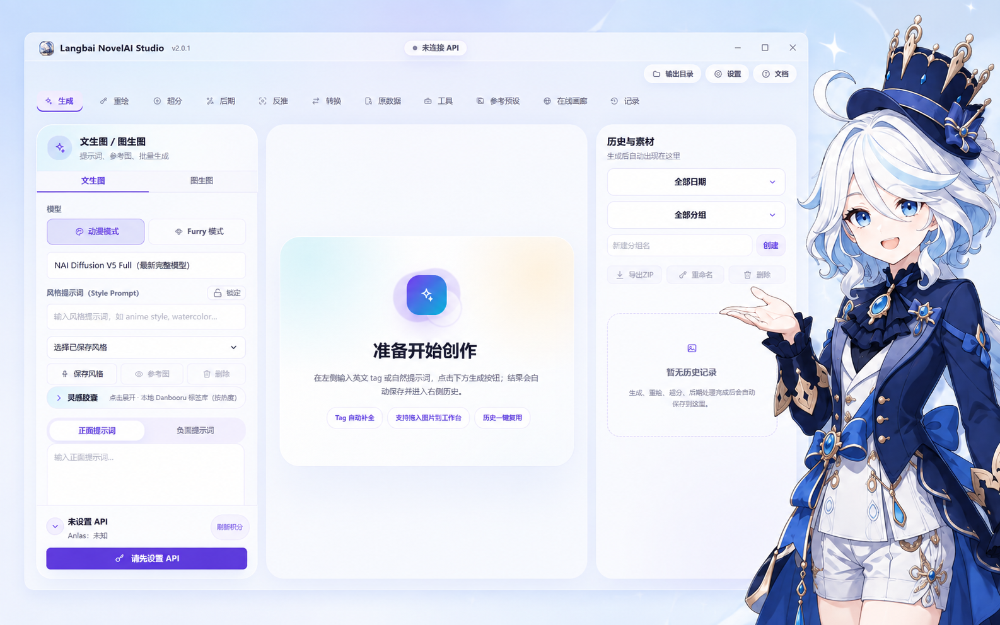
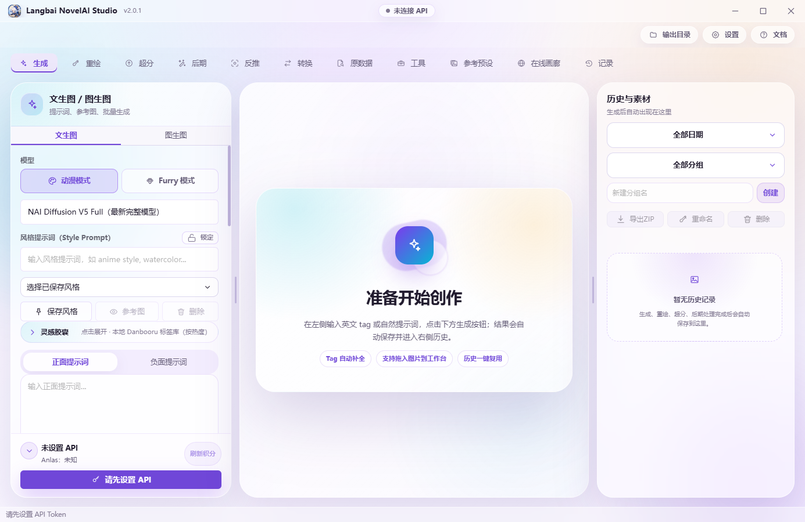
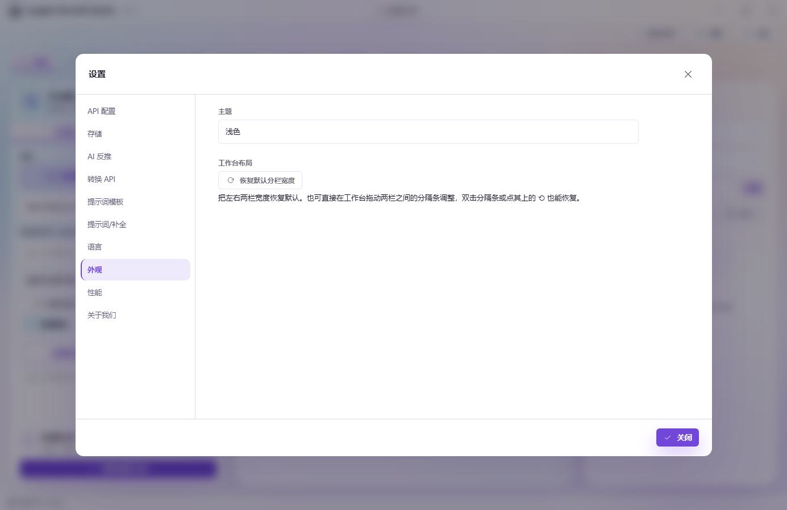

# Langbai NovelAI Studio

> v2.5.2: Windows x64 설치 및 포터블 버전입니다. Android/iOS 공통 기능 소스는 동기화되며 이번 릴리스에는 모바일 설치 파일이나 실기기·서명 검증이 포함되지 않습니다.

[简体中文](./README.md) · [繁體中文](./README.zh-TW.md) · [English](./README.en.md) · [日本語](./README.ja.md) · [한국어](./README.ko.md)


**v2.4.3 플랫폼 안내:** 독립 Tavern Agent는 Windows x64 및 Android ARM64(Android 8 이상)를 지원하며 다른 플랫폼은 기존 Tavern을 유지합니다. 페이지를 열어도 다운로드하지 않으며 설치 전 버전과 크기를 표시하고 확인을 요청합니다. 구성 요소를 제거해도 대화와 사용자 자료는 보존되며 재설치 후 다시 사용할 수 있습니다.

### 하나의 아이디어에서 여러 작품으로.

중국어 간체·번체, 영어, 일본어, 한국어 UI를 지원하는 NovelAI 이미지 제작 작업 공간입니다.



**[최신 버전 다운로드](https://github.com/2786886095/novelai-image-desktop/releases/latest)** · [시작 안내(중국어)](./docs/guide/GETTING_STARTED.md) · [기능 안내(중국어)](./docs/guide/FEATURES.md)

> 본인의 **NovelAI Persistent API Token**이 필요합니다. 모델 권한과 생성 비용은 NovelAI 계정에 따라 결정됩니다. 이미지 분석, 프롬프트 변환, Tavern AI 등 선택 기능은 별도로 설정해야 합니다.

## 빠른 시작

1. 릴리스 페이지에서 운영체제에 맞는 패키지를 받으세요. 일반 사용자는 Node.js 설치나 소스 빌드가 필요하지 않습니다.
2. **설정 → API 설정**에서 앱 안내에 따라 Token을 입력하고 검증하거나 잔액을 새로고침하세요.
3. **생성**에서 사용 가능한 모델과 프롬프트를 선택하고 이미지 크기, 장수, 예상 비용을 확인한 후 생성하세요. 데스크톱 결과는 출력 폴더와 기록에 저장됩니다.

```text
1girl, solo, blue hair, blue eyes, white dress, garden, sunlight, smile
```

처음에는 기본 매개변수로 한 장을 생성한 뒤 선택 서비스를 설정하세요. 표시 언어는 설정에서 변경할 수 있습니다. 사용자 프롬프트, 파일 이름, 대화 내용은 번역하지 않습니다.

## 작업별 도구

| 작업 | 기능 | 안내(중국어) |
| --- | --- | --- |
| 이미지 생성과 수정 | 텍스트·이미지 기반 생성, 캐릭터 프롬프트와 위치 | [생성](./docs/guide/FEATURES.md#generation) |
| 대화로 구상하기 | Tavern AI, 확인 후 생성 또는 자동 생성 | [Tavern](./docs/guide/FEATURES.md#tavern) |
| 연속 장면 만들기 | 만화 생성기, 스토리보드, 후보, 선택 이미지 ZIP 내보내기 | [만화](./docs/guide/FEATURES.md#comic) |
| 캐릭터·분위기 참조 재사용 | 정밀 참조, 분위기 전이, 온라인 목록, 프리셋 | [참조](./docs/guide/FEATURES.md#reference) |
| 프롬프트와 화풍 탐색 | 아이디어, 이미지 분석, 변환, 화풍 실험실, 개인 코덱스 | [프롬프트](./docs/guide/FEATURES.md#prompt) |
| 이미지 매개변수 재사용 | 메타데이터 분석, 갤러리, 호환 설정 가져오기 | [재사용](./docs/guide/FEATURES.md#reuse) |
| 결과 정리 | 기록 그룹, 시드 고정 변형, 이름 변경, ZIP 내보내기 | [관리](./docs/guide/FEATURES.md#manage) |

Tavern, 만화, 참조 프리셋은 서로 다른 작업 흐름입니다. 만화는 컷마다 여러 후보를 생성하고 선택한 최종 이미지만 내보낼 수 있습니다. 참조 효과는 모델과 설정에 따라 달라지며 동일한 결과를 보장하지 않습니다.

Windows 로컬 Artist Detective 작업은 현재 **NAI 4.5 Full만** 지원합니다. 전체 로컬 평가 모델에는 최소 8 GB VRAM이 필요합니다. 경량 모델은 저용량 VRAM 환경용이지만 모든 장치에 적용되는 최소 용량은 검증하지 않았습니다. NovelAI는 클라우드에서 이미지를 생성하고 로컬 CUDA는 화풍을 평가합니다. 유사도 점수는 **재현율이 아닙니다**. 모델과 실행 환경은 앱과 별도로 다운로드합니다.

Tavern Agent는 사용자 확인 후 검증된 호환 구성 요소를 설치하며 임의의 공식 최신 버전을 바로 설치하지 않습니다. 사용자가 추가하거나 수정한 플러그인은 보존하지만 모든 타사 플러그인 조합의 호환성을 보장하지 않습니다. [업데이트 및 복구 안내(중국어)](./docs/TAVERN_AGENT_UPDATES.md).

## 미리 보기

아래 기존 스크린샷은 **2026-08-30 / v2.0.1**의 레이아웃 예시이며 현재 모든 기능을 보여 주지는 않습니다. 위 홍보 그림은 실제 기능 스크린샷이 아닙니다.



<details><summary>설정 화면</summary>



</details>

## 설치 및 업데이트

사용 가능한 파일과 버전별 안내는 [최신 릴리스](https://github.com/2786886095/novelai-image-desktop/releases/latest)를 확인하세요. [변경 기록(중국어)](./docs/RELEASE_NOTES.md).

| 플랫폼 | 패키지 | 참고 |
| --- | --- | --- |
| Windows x64 | 설치 EXE / 포터블 EXE | 설치판은 바로가기와 앱 내 업데이트를 제공합니다. 포터블은 새 파일로 수동 교체합니다. |
| macOS Intel / Apple silicon | Universal DMG / ZIP | 서명되지 않았습니다. 시스템 안내는 설치 가이드를 참조하세요. |
| Linux x64 | AppImage | 실행 권한을 부여한 뒤 실행하세요. |
| Android | APK | 수동 설치합니다. |
| iOS | 미서명 IPA | 직접 서명하거나 사이드로드해야 하며 App Store 패키지가 아닙니다. |

Windows 설치판과 포터블은 `%APPDATA%\novelai-image-desktop\`을 공유합니다. 포터블이라고 **모든 데이터가 실행 파일 옆에 저장되는 것은 아닙니다**. 패키지를 교체하기 전에 설정과 작품을 백업하세요. 데스크톱과 모바일의 기능은 같지 않으며 로컬 화풍 반복 작업은 Windows 전용입니다. [플랫폼 차이](./docs/guide/FEATURES.md#platforms).

## 자주 묻는 질문

- **오픈소스면 무료로 생성할 수 있나요?** 아닙니다. NovelAI 계정, 모델 권한, 사용량이 필요합니다. 실제 Anlas 요금은 서비스가 결정하며 앱 표시 금액은 예상치입니다.
- **기본 생성에도 추가 AI API가 필요한가요?** 아닙니다. NovelAI Token부터 설정하세요. 이미지 분석, 변환, 대화 모델은 설정과 요금이 별도입니다.
- **SD / ComfyUI 메타데이터를 읽으면 해당 모델도 실행하나요?** 아닙니다. 호환 프롬프트, 크기, 시드를 재사용할 수 있을 뿐 모델, VAE, LoRA, 워크플로 정보는 확인용입니다.
- **모바일은 기본 생성만 지원하나요?** 아닙니다. Tavern, 만화, 참조, 갤러리, 이미지 분석, 메타데이터 도구도 있습니다. 다만 플랫폼별 기능은 다릅니다.

[연결 및 저장 문제 해결(중국어)](./docs/guide/GETTING_STARTED.md#troubleshooting).

## 데이터 및 연결

- NovelAI와 API로 통신하며 브라우저 자동화나 쿠키 추출을 사용하지 않습니다. 데스크톱 요청은 Electron 메인 프로세스에서 처리하고 인증 정보와 설정은 로컬에 저장합니다.
- 생성 시 프롬프트와 필요한 참조 이미지를 NovelAI로 전송합니다. 선택 AI 기능의 입력은 사용자가 설정한 서비스로 보내며 갤러리, 참조, 태그 서비스는 각 데이터 소스에 연결합니다.
- 메타데이터 분석은 로컬에서 수행하며 Anlas를 소비하지 않습니다. 저장된 참조와 사전의 오프라인 열람은 **오프라인 이미지 생성이 아닙니다**.
- Issue를 제출하기 전에 Token, API Key, 개인 대화, 민감한 이미지를 제거하세요. 업스트림 진단 로그는 원문 언어로 표시될 수 있습니다.

## 개발 및 커뮤니티

데스크톱: Electron + React + TypeScript. 모바일: Flutter.

[빌드 안내(중국어)](./docs/guide/DEVELOPMENT.md) · [기여 안내](./CONTRIBUTING.md) · [타사 고지](./THIRD_PARTY_NOTICES.md) · [MIT 코드 라이선스](./LICENSE)

[문제 신고](https://github.com/2786886095/novelai-image-desktop/issues/new) · [기존 Issue](https://github.com/2786886095/novelai-image-desktop/issues) · QQ 그룹: **921985070**

마스코트는 원신의 푸리나입니다. 홍보 이미지는 비공식 AI 생성 팬아트이며 HoYoverse 또는 NovelAI와의 공식 제휴나 승인을 의미하지 않습니다. 코드의 MIT 라이선스는 타사 캐릭터, 상표, 소재의 권리를 부여하지 않습니다. [시각 자료 기록](./docs/assets/readme/ASSETS.md).
