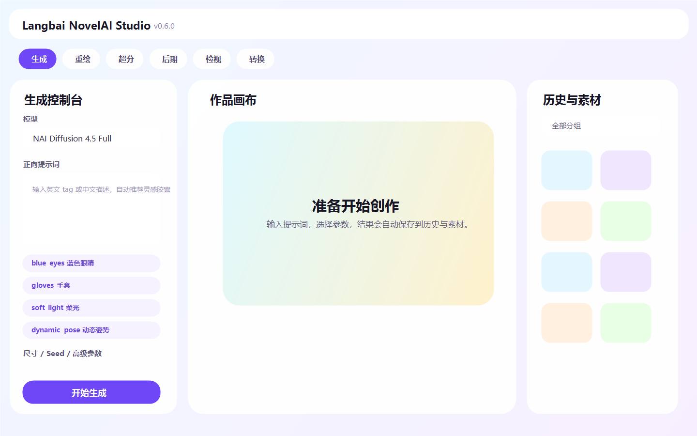
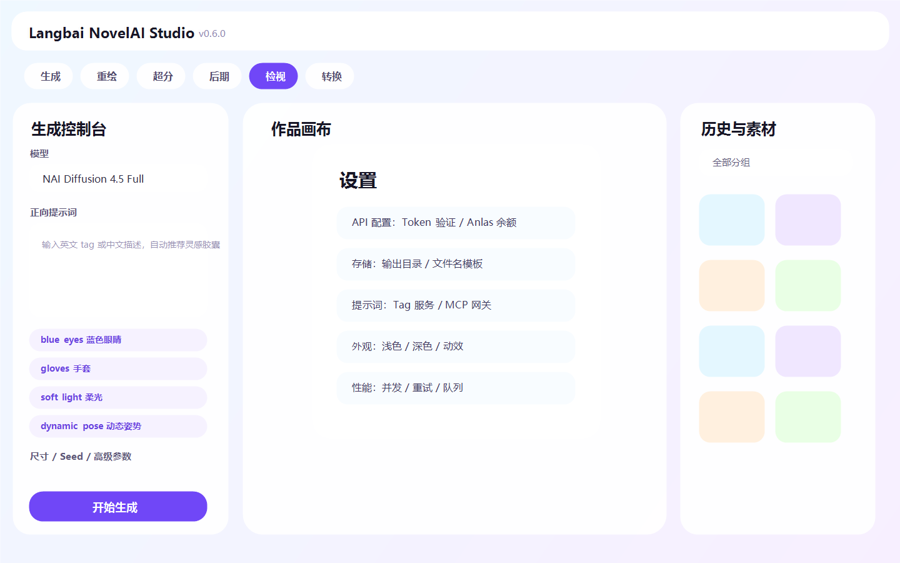
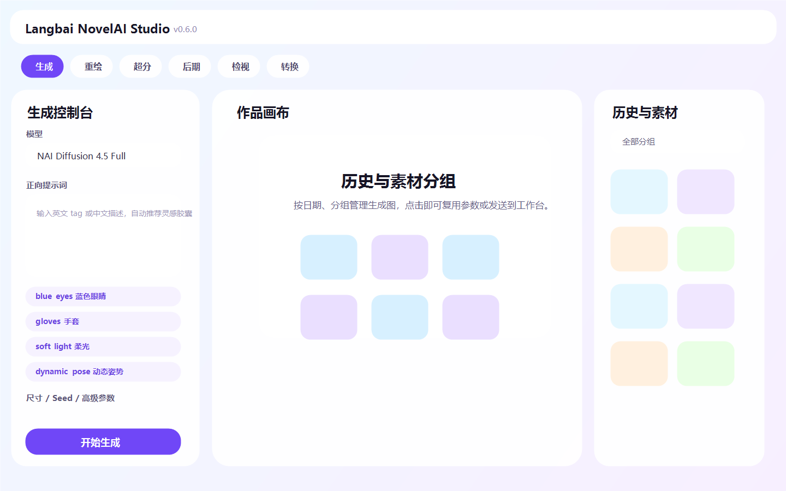

# Langbai NovelAI Studio

[](https://github.com/2786886095/novelai-image-desktop/actions/workflows/build.yml)
[](https://github.com/2786886095/novelai-image-desktop/actions/workflows/build-mobile.yml)
[](./LICENSE)
[](https://github.com/2786886095/novelai-image-desktop/releases/tag/v0.7.6)
[](#下载)


中文 **API-only** NovelAI 图像创作工作台。桌面端基于 Electron + React + TypeScript，移动端基于 Flutter。

它不走网页登录、Cookie、DOM 点击或 Chrome CDP。NovelAI 图像能力由 Electron 主进程调用官方 API；渲染进程不直接持有 Token。

## 下载

- **v0.7.6 正式版**：[GitHub Releases](https://github.com/2786886095/novelai-image-desktop/releases/tag/v0.7.6)
- **持续构建产物**：[GitHub Actions](https://github.com/2786886095/novelai-image-desktop/actions)

Release 目标产物：

| 平台 | 文件 |
| --- | --- |
| Windows | `Langbai-NovelAI-Studio-0.7.6.exe` |
| macOS | universal `.dmg` + `.zip` |
| Linux | `.AppImage` |
| Android | `app-release.apk` |
| iOS | `novelai-mobile-unsigned.ipa` |

> macOS 包当前未签名，首次打开可能需要右键“打开”。iOS IPA 当前未签名，需要自行侧载或用自己的 Apple 证书签名。

## 截图

| 生成工作台 | 设置中心 | 历史与素材 |
| --- | --- | --- |
|  |  |  |

## 核心能力

- **API Token 登录**：验证 NovelAI Persistent API Token，本地保存账号摘要。
- **Anlas 余额**：支持手动刷新余额，并在生成前显示预计成本与余额不足提示。
- **文生图**：模型、风格词、正/负面提示词、尺寸、Seed、Steps、CFG、采样器、UC Preset、Quality Toggle、SMEA、Variety+。
- **图生图**：加载 PNG/JPG/WebP 基图，支持 Strength、Noise、Extra Noise Seed。
- **局部重绘**：内置蒙版画布，调用 NovelAI `infill`。
- **云端超分**：2x / 4x 超分。
- **Director Tools 后期**：移除背景、线稿、草图、上色、表情迁移、去杂乱。
- **Tag 自动补全**：输入英文时自动推测 Danbooru / NovelAI 常用 tag；失败时使用本地高频词库兜底。
- **灵感胶囊**：可折叠（默认收起为一行），内置约 190 个中文概念词库，支持「蓝眼白发夜景」这类复合中文查询，一键插入对应 Danbooru 标签。
- **标签权重微调**：提示词下方按标签提供 − / ＋ 控件，基于 NovelAI 的 `{}` / `[]` 语法增减权重并显示近似倍率。
- **中英翻译**：一键将中文提示词翻译为英文，可在设置中选择谷歌翻译（免费）或百度翻译 API（填 APP ID 与密钥）。
- **Tag/MCP 服务**：支持普通 HTTP 接口，以及 MCP 的 Streamable HTTP / SSE / stdio 三种传输（可直连 DanbooruSearchOnline 的 `search_tags`），补强自动补全、AI 反推和中文转换。
- **AI 反推 / 提示词转换**：反推使用视觉模型 API；转换使用文本模型 API，二者独立配置；检测接口后可在下拉列表中切换模型。
- **历史与素材分组**：按日期和分组筛选，新建 / 重命名 / 删除分组，给图片分组，一键 ZIP 导出。
- **生成队列**：批量任务可暂停 / 继续，失败后重试并跳过，记录实扣 Anlas。
- **锁种变体**：复用历史图参数并锁定 seed，适合微调单个 tag。
- **图片命名**：生成面板可填写文件名前缀；历史面板每张图片可单独重命名（同步重命名本地文件）。
- **动态提示词通配符**：支持 `{red|blue|green} hair` 这种本地随机展开。

## 快速开始

```powershell
npm install
npm run dev
```

首次启动后：

1. 打开“设置 > API 配置”，粘贴 NovelAI Persistent API Token。
2. 点击“验证 Token / 刷新积分”确认账号与余额。
3. 选择模型，填写提示词与参数。
4. 点击生成；图片会自动保存到输出目录，并进入右侧历史与素材库。
5. 可在历史面板创建分组、复用参数、发送到图生图 / 重绘 / 超分 / 后期。

## 构建

```powershell
npm run typecheck
npm test
npm run build
npm run pack
```

本地 Windows 便携包输出：

```text
release\Langbai-NovelAI-Studio-0.7.6.exe
release\Langbai-NovelAI-Studio.exe
```

兼容旧启动脚本的别名仍会生成：

```text
release\NovelAI-Image-Desktop.exe
```

双击或运行：

```text
启动程序.bat
```

## 全端发布

推送 `v*` tag 会触发桌面端与移动端两个 workflow，并把所有平台产物汇总到同一个 Release：

```powershell
git tag v0.7.6
git push origin main
git push origin v0.7.6
```

如果 Release 上传时报 403，请在仓库 `Settings -> Actions -> General -> Workflow permissions` 中启用 `Read and write permissions`。

## 安全说明

- NovelAI Token 只保存在本机 Electron 用户数据目录。
- 渲染进程不直接持有 Token，API 请求由主进程执行。
- AI 反推、提示词转换、Tag/MCP 服务的 Key / Endpoint 也只保存在本机配置中。
- README 与仓库不会写入任何用户 Token。
- 成本显示为本地估算与余额差值记录；实际扣费以 NovelAI 官方结果为准。

## 关键文件

- `electron/main.ts`：Electron 窗口与 IPC 注册。
- `electron/ipc/nai.ts`：NovelAI API、AI 反推、提示词转换、模型检测。
- `electron/ipc/store.ts`：设置、Token 摘要、历史索引、素材分组。
- `electron/ipc/storage.ts`：历史删除、目录选择、分组操作。
- `electron/preload.ts`：安全暴露 `window.naiDesktop`。
- `src/App.tsx`：主 UI、设置、历史、反推、转换。
- `src/components/ui.tsx`：共享 UI 基础组件。
- `src/prompt-data.ts`：标签分类、中文含义、灵感胶囊词条。
- `src/InpaintCanvas.tsx`：局部重绘蒙版画布。
- `src/store.ts`：Zustand 前端状态。
- `src/types.ts`：共享类型、版本号和默认参数。
- `mobile/`：Flutter Android / iOS 客户端。

## 移动端

`mobile/` 是 Flutter 编写的 Android / iOS 客户端。当前阶段包含 Token 配置、文生图与图库基础能力。

```powershell
cd mobile
flutter pub get
flutter analyze
flutter test
```

## 贡献

欢迎提交 Issue / PR。请先阅读 [CONTRIBUTING.md](./CONTRIBUTING.md)。本项目使用 [MIT License](./LICENSE)。
