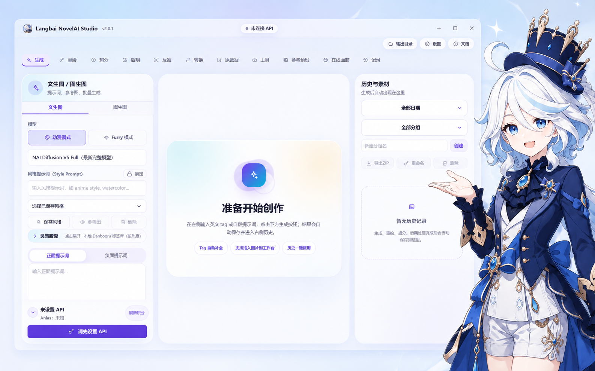
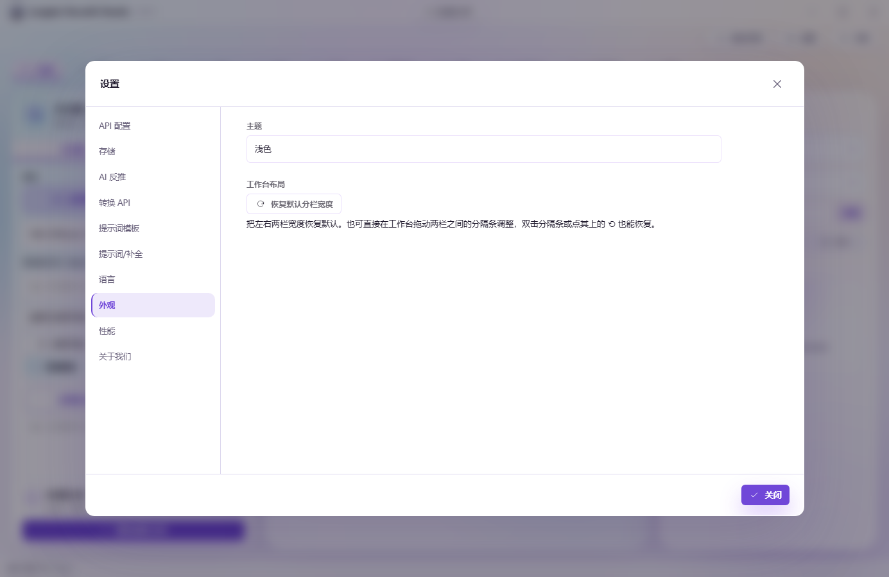

# Langbai NovelAI Studio

### 从一句灵感，到一组作品。

中文 NovelAI 图像创作工作台。



<a href="https://github.com/2786886095/novelai-image-desktop/releases/latest"></a>
&nbsp; **[首次使用教程](./docs/guide/GETTING_STARTED.md)** · **[查看全部功能](./docs/guide/FEATURES.md)** · [国内下载线路](https://gitee.com/langbai666/novelai-image-desktop/releases)

> 需配置自己的 **NovelAI Persistent API Token**，生成费用与模型权限以 NovelAI 账号为准。[反推、转换和酒馆等可选 AI 服务需另行配置](./docs/guide/GETTING_STARTED.md#optional)。

[](https://github.com/2786886095/novelai-image-desktop/releases/latest)
[](https://github.com/2786886095/novelai-image-desktop/actions/workflows/build.yml)
[](https://github.com/2786886095/novelai-image-desktop/actions/workflows/build-mobile.yml)
[](./LICENSE)

<a id="quick-start"></a>
## 先完成你的第一张图

1. **下载客户端**：从[下载区](#download)选择适合系统的安装包。普通使用者不需要安装 Node.js，也不需要运行源码命令。
2. **连接账号**：打开「设置 → API 配置」，按软件内图文教程获取并填写 Token，点击「验证 Token / 刷新积分」。
3. **开始创作**：进入「生成」，选择账号可用模型，输入提示词，检查尺寸、张数与预计费用，然后生成。桌面端结果会保存到输出目录并进入历史与素材。

第一次使用可以从一段简单的英文提示词开始，其余参数先保留默认值：

```text
1girl, solo, blue hair, blue eyes, white dress, garden, sunlight, smile
```

连接失败、Token 获取方式和结果保存位置见[首次使用教程](./docs/guide/GETTING_STARTED.md)。先跑通一次生成，再配置可选的 AI 和标签服务。

<a id="features"></a>
## 按创作任务找到工具

| 你想做什么 | 使用功能 | 从哪里开始 |
| --- | --- | --- |
| 从描述生成图片，或调整已有图片 | 文生图、图生图、角色提示词与位置 | [生成与修图](./docs/guide/FEATURES.md#generation) |
| 边聊边构思，再把方案变成图 | 酒馆 AI 生图、确认后生图 / 全自动生图 | [酒馆对话创作](./docs/guide/FEATURES.md#tavern) |
| 批量制作连续画面并挑选终稿 | 漫画生成器、分镜参数、候选图、主图 ZIP | [漫画与批量任务](./docs/guide/FEATURES.md#comic) |
| 让角色或氛围更接近参考 | 精准参考、氛围迁移、在线参考目录、预设库 | [角色参考](./docs/guide/FEATURES.md#reference) |
| 找到合适的描述和画风 | 灵感胶囊、反推、转换、画风实验室、个人法典 | [提示词与画风](./docs/guide/FEATURES.md#prompt) |
| 复用一张图的生成参数 | 原数据读取、在线画廊、兼容参数选择应用 | [素材与参数复用](./docs/guide/FEATURES.md#reuse) |
| 整理结果、继续迭代 | 历史分组、参数复用、锁种变体、重命名、ZIP 导出 | [记录与管理](./docs/guide/FEATURES.md#manage) |

### 对话、分镜、参考，各有自己的工作流

- **酒馆 AI 生图**：先聊构图和细节，再选择确认方案或自动生成。右侧创作参数是默认来源；未明确指定的参数不会由模型随意覆盖，空风格词也不会从生成页串入。支持角色卡、世界书、用户设定、对话预设与会话管理。
- **漫画生成器**：导入逐行 Tag 或 JSON/CSV 分镜，统一全局风格与负面词，再单独微调某个分镜。每个分镜可以生成多张候选、追加尝试、选定主图，最后只导出选中的主图。
- **角色参考预设库**：按游戏、角色与形态寻找参考，将精准参考或氛围迁移配置保存为预设，分组管理、导入导出，下次创作直接复用。参考效果取决于所用模型及参数，并不保证每张图完全一致。

<a id="screenshots"></a>
## 看看实际工作台

下面是仓库已有的 **2026-08-30 / v2.0.1 实际界面截图**，用于展示布局；v2.2.8 已增加酒馆等入口，具体功能以当前版本为准。顶部芙宁娜配图是宣传插画，不作为功能截图。


<details>
<summary>展开查看设置与外观</summary>



</details>

<a id="download"></a>
## 下载与安装

**[GitHub 最新发行版](https://github.com/2786886095/novelai-image-desktop/releases/latest)** · [Gitee 国内线路](https://gitee.com/langbai666/novelai-image-desktop/releases) · [更新记录](./docs/RELEASE_NOTES.md)

以下直链对应 **[v2.2.8](https://github.com/2786886095/novelai-image-desktop/releases/tag/v2.2.8)**（[该版本 Gitee 镜像](https://gitee.com/langbai666/novelai-image-desktop/releases#release-v2.2.8)）；后续版本请使用上面的「最新发行版」。镜像同步进度可能不同，某个包暂缺时使用 GitHub。

| 平台 | 选择安装包 | 使用说明 |
| --- | --- | --- |
| Windows x64 · 安装版 | [Setup.exe](https://github.com/2786886095/novelai-image-desktop/releases/download/v2.2.8/Langbai-NovelAI-Studio-Setup-2.2.8.exe) | 长期使用建议选这个；安装向导、快捷方式、软件内更新 |
| Windows x64 · 便携版 | [便携版.exe](https://github.com/2786886095/novelai-image-desktop/releases/download/v2.2.8/Langbai-NovelAI-Studio-2.2.8.exe) | 双击运行；启动时解压到临时目录，更新需下载新包替换 |
| macOS · Intel / Apple 芯片 | [通用 DMG](https://github.com/2786886095/novelai-image-desktop/releases/download/v2.2.8/Langbai-NovelAI-Studio-2.2.8-universal.dmg) / [ZIP](https://github.com/2786886095/novelai-image-desktop/releases/download/v2.2.8/Langbai-NovelAI-Studio-2.2.8.zip) | 当前未签名；安装与系统提示处理见[安装说明](./docs/guide/GETTING_STARTED.md#install) |
| Linux x64 | [AppImage](https://github.com/2786886095/novelai-image-desktop/releases/download/v2.2.8/Langbai-NovelAI-Studio-2.2.8.AppImage) | 添加执行权限后运行 |
| Android | [APK](https://github.com/2786886095/novelai-image-desktop/releases/download/v2.2.5/app-release.apk) | 手动安装 APK |
| iOS | [未签名 IPA](https://github.com/2786886095/novelai-image-desktop/releases/download/v2.2.5/novelai-mobile-unsigned.ipa) | 需要自行签名或侧载，不是 App Store 安装包 |

**v2.2.8 为电脑端更新；Android / iOS 暂时保留 v2.2.5 下载，不发布未纳入本轮验收的手机包。**

Windows 便携版与安装版共享本机用户数据目录 `%APPDATA%\novelai-image-desktop\`。**便携版不等于零痕迹，也不是所有数据都写在程序旁边。** 更换包前建议备份设置和作品。

桌面端和移动端可以在设置中选择 GitHub / Gitee 更新源，默认 GitHub，所选源不可用时尝试备用源。不同平台的更新方式见[安装与更新](./docs/guide/GETTING_STARTED.md#updates)。

<a id="faq"></a>
## 常见问题

<details>
<summary><b>软件开源，是不是就能免费生图？</b></summary>

客户端代码开源不等于 NovelAI 服务免费。需要自己的 NovelAI 账号、Token 和对应模型权限；Anlas、订阅额度与实际扣费以官方为准。软件显示的预计费用用于辅助判断。

</details>

<details>
<summary><b>只想生成图片，也要配置反推、转换和酒馆 API 吗？</b></summary>

不需要。基础 NovelAI 生图先配置 NovelAI Token 即可。图片反推使用视觉模型 API，提示词转换使用文本模型 API，酒馆对话使用对话模型配置；这些是可选能力，费用与连接状态分别计算。

</details>

<details>
<summary><b>能读取 ComfyUI / SD 图片参数，是不是也能运行这些模型？</b></summary>

原数据工具可以读取 NAI、SD WebUI / Forge、ComfyUI 图片中保留的元数据，但这不代表客户端会运行本地 SD 或 ComfyUI 工作流。只有兼容的提示词、尺寸、Seed 等参数可以应用到 NovelAI；模型、VAE、LoRA 和工作流信息用于查看。

</details>

<details>
<summary><b>手机端只有基础生图吗？</b></summary>

不止。移动端已有酒馆、漫画、参考预设、在线画廊、反推与原数据等功能。桌面端和移动端不保证每个工具完全相同；例如桌面的本地画风相似度迭代仅 Windows 提供。各项平台差异见[功能指南](./docs/guide/FEATURES.md#platforms)。

</details>

更多连接、保存与报错排查见[首次使用教程](./docs/guide/GETTING_STARTED.md#troubleshooting)。

<a id="privacy"></a>
## 数据与连接方式

- 客户端通过 API 连接 NovelAI，不依赖网页登录自动化、Cookie 抓取或浏览器点击。
- 桌面端由 Electron 主进程处理 NovelAI 请求，渲染进程不直接持有 Token；凭据与设置保存在本机配置中。
- 生成会将提示词与所需参考图片发送给 NovelAI；使用反推、转换或酒馆时，相应输入会发送到你配置的模型服务。在线画廊、参考目录和 Tag/MCP 服务各自访问对应数据源。
- 原数据读取在本地完成，不调用生图接口、不消耗 Anlas；部分离线词库和已保存的参考预设也可离线查看。**离线查看不代表离线生图。**
- 提交 Issue 前请移除 Token、API Key、私人对话与敏感图片。

<a id="development"></a>
## 给开发者

桌面端：Electron + React + TypeScript。移动端：Flutter。

[源码运行与构建](./docs/guide/DEVELOPMENT.md) · [贡献指南](./CONTRIBUTING.md) · [第三方声明](./THIRD_PARTY_NOTICES.md) · [MIT 代码许可证](./LICENSE)

<a id="community"></a>
## 交流与反馈

[提交问题](https://github.com/2786886095/novelai-image-desktop/issues/new) · [查看已有问题](https://github.com/2786886095/novelai-image-desktop/issues)

NovelAI 交流群：**921985070**。欢迎交流软件使用、提示词和创作经验。

<details>
<summary>展开 QQ 群二维码</summary>


</details>

---

看板娘为《原神》角色芙宁娜，宣传图为 AI 生成的非官方同人视觉，与 HoYoverse / NovelAI 无官方合作或背书关系。项目代码的 MIT 许可不授予第三方角色、商标或素材权利。配图说明见[视觉素材记录](./docs/assets/readme/ASSETS.md)。
