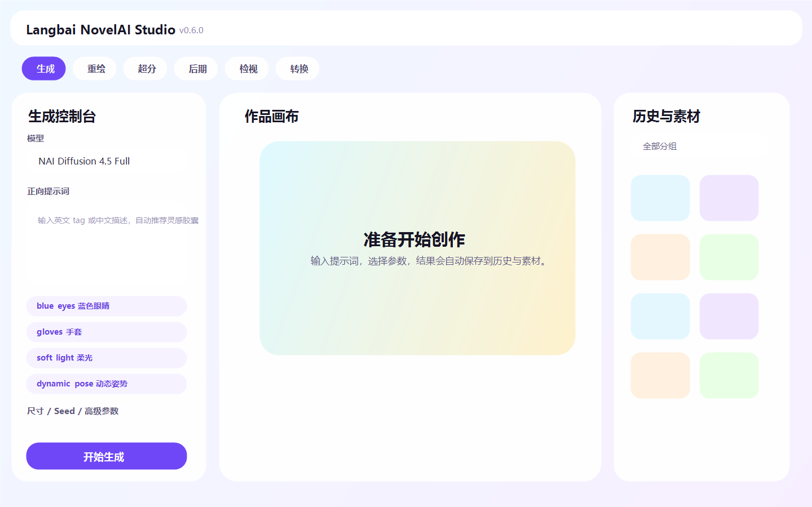
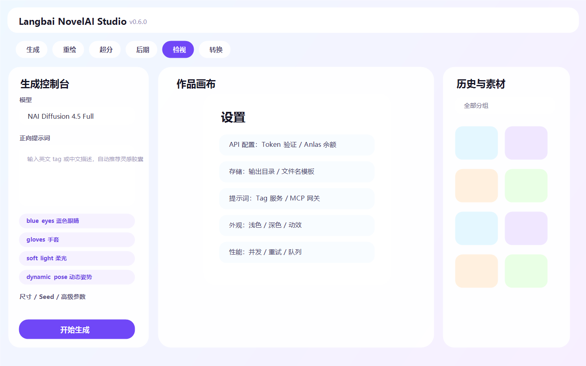
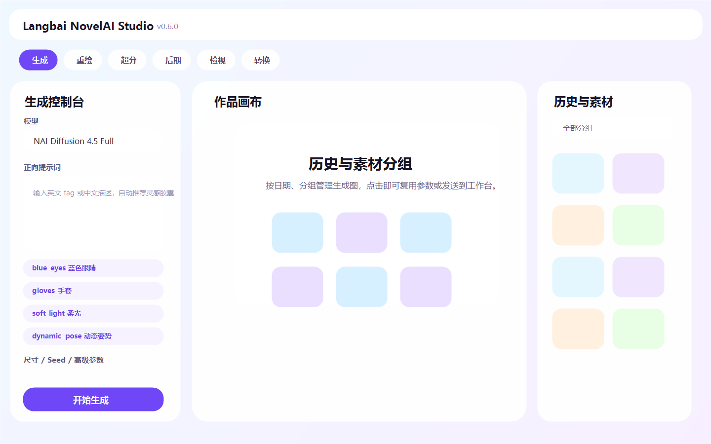
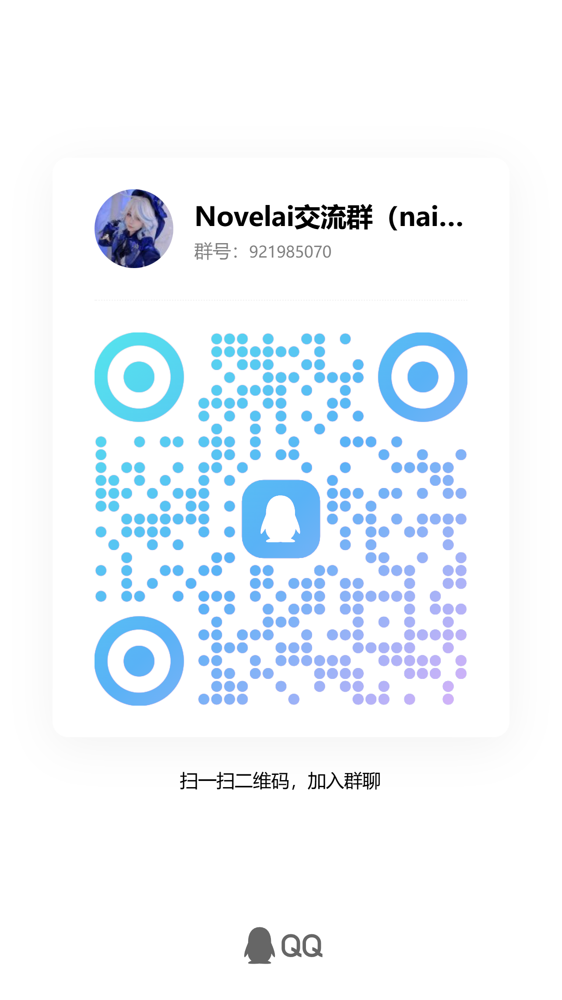

# Langbai NovelAI Studio

[](https://github.com/2786886095/novelai-image-desktop/actions/workflows/build.yml)
[](https://github.com/2786886095/novelai-image-desktop/actions/workflows/build-mobile.yml)
[](./LICENSE)
[](https://github.com/2786886095/novelai-image-desktop/releases/tag/v1.9.7)
[](#下载)


中文 **API-only** NovelAI 图像创作工作台。桌面端基于 Electron + React + TypeScript，移动端基于 Flutter。

它不走网页登录、Cookie、DOM 点击或 Chrome CDP。NovelAI 图像能力由 Electron 主进程调用官方 API；渲染进程不直接持有 Token。

## 下载

- **v1.9.7 中国大陆线路**：[Gitee Releases](https://gitee.com/langbai666/novelai-image-desktop/releases/tag/v1.9.7)
- **v1.9.7 全球线路**：[GitHub Releases](https://github.com/2786886095/novelai-image-desktop/releases/tag/v1.9.7)
- **持续构建产物**：[GitHub Actions](https://github.com/2786886095/novelai-image-desktop/actions)

Release 目标产物：

| 平台 | 文件 |
| --- | --- |
| Windows（便携版） | `Langbai-NovelAI-Studio-1.9.7.exe` |
| Windows（安装版） | `Langbai-NovelAI-Studio-Setup-1.9.7.exe` |
| macOS | universal `.dmg` + `.zip` |
| Linux | `.AppImage` |
| Android | `app-release.apk` |
| iOS | `novelai-mobile-unsigned.ipa` |

> macOS 包当前未签名，首次打开可能需要右键“打开”。iOS IPA 当前未签名，需要自行侧载或用自己的 Apple 证书签名。

**Windows 两种包怎么选：**

| | 便携版 `.exe` | 安装版 `Setup.exe` |
| --- | --- | --- |
| 使用方式 | 双击直接用，不用安装 | 走安装向导，可自选安装路径、创建桌面/开始菜单快捷方式 |
| 启动速度 | 每次启动需要先解压到临时目录，略慢 | 直接从安装目录运行，启动更快 |
| 更新方式 | 软件内提示新版本后按设置的 GitHub / Gitee 下载源打开发行页，手动下载替换 | 软件内按设置的 GitHub / Gitee 下载源直接下载并一键重启安装；失败时自动切换备用源 |
| 适合场景 | 想即开即用、放 U 盘带走、不想在系统里留痕迹 | 想长期使用、希望免去手动更新的麻烦 |

两者的账号 Token、历史记录、设置是共享的（都存在 `%APPDATA%\novelai-image-desktop\`），换用哪个都不会丢数据。

## 截图

| 生成工作台 | 设置中心 | 历史与素材 |
| --- | --- | --- |
|  |  |  |

## 核心能力

- **API Token 登录**：验证 NovelAI Persistent API Token，本地保存账号摘要。
- **Anlas 余额**：支持手动刷新余额，并在生成前显示预计成本与余额不足提示。
- **V5 Opus 额度**：直接读取 NovelAI 官方 `image.novelai.net/user/data` 账号数据，实时显示剩余比例、约可生成张数与每日恢复速度；自动与手动刷新失败时保留并标记上次成功数据，不伪造实时状态。
- **文生图**：模型、风格词、正/负面提示词、任意有效 64 倍数尺寸、Seed、Steps、CFG、采样器、UC Preset、质量词（标准/轻量/关闭）、透明背景、SMEA、Variety+；尺寸输入完成并失焦/按 Enter 后才校准，支持官方小图、标准、大图与壁纸预设。
- **图生图**：加载 PNG/JPG/WebP 基图，默认按原图自适应到最接近的有效 64 倍数，也可自定义尺寸；支持 Strength、Noise、Extra Noise Seed。
- **局部重绘**：内置蒙版画布，调用 NovelAI `infill`。
- **云端超分**：2x / 4x 超分。
- **Director Tools 后期**：移除背景、线稿、草图、上色、表情迁移、去杂乱。
- **Tag 自动补全**：输入英文时自动推测 Danbooru / NovelAI 常用 tag；失败时使用本地高频词库兜底。
- **灵感胶囊**：内置 4000+ 个中文概念词库（按 14 大类 + 细分子类归好，每个 tag 都对应正确分类），支持「蓝眼白发夜景」这类复合中文查询，一键插入对应 Danbooru 标签。
- **标签权重微调**：提示词下方按标签提供 − / ＋ 控件，基于 NovelAI 的 `{}` / `[]` 语法增减权重并显示近似倍率。
- **角色提示词与位置**：每个角色卡片可独立展开/折叠；角色提示词可在“AI 自动选择”和“自定义拖动”间切换，桌面与移动端均可在按当前生成比例显示的画布上直接拖动编号标记，并保留精确 X/Y 调整。
- **下载与更新源**：桌面端和 Android/iOS 均可在设置中选择 GitHub（国际线路推荐）或 Gitee（中国大陆用户推荐）；默认 GitHub，所选源不可用时自动切换备用源。
- **中英翻译**：一键将中文提示词翻译为英文，可在设置中选择谷歌翻译（免费）或百度翻译 API（填 APP ID 与密钥）。
- **Tag/MCP 服务**：支持普通 HTTP 接口，以及 MCP 的 Streamable HTTP / SSE / stdio 三种传输（可直连 DanbooruSearchOnline 的 `search_tags`），补强自动补全、AI 反推和中文转换。
- **AI 反推 / 提示词转换**：反推使用视觉模型 API；转换使用文本模型 API，二者独立配置；检测接口后可在下拉列表中切换模型。
- **历史与素材分组**：按日期和分组筛选，新建 / 重命名 / 删除分组，给图片分组，一键 ZIP 导出。
- **角色参考预设库**：桌面端与移动端均可管理氛围迁移/精准参考预设，并从 Gitee 优先的在线目录按游戏、分类和角色形态下载最佳尺寸精准参考图；支持按游戏整系列下载、下载前查看数量与总大小、聚合进度、五语言显示与跨语言搜索、双击预览、分组、导入导出及离线复用。
- **生成队列**：批量任务可暂停 / 继续，失败后重试并跳过，记录实扣 Anlas。
- **小说推文（桌面端）**：导入小说/字幕 → LLM 分镜旁白（无 API/拒答时本地模板兜底）→ 全局精准参考/角色库 → 批量生图续跑 → TTS/逐镜配音/按字幕切分长音频 → 运镜转场预览 → 写入剪映 10.9 草稿；项目会写磁盘快照，长队列中断后可恢复。
- **漫画生成器**：直接导入逐行 Tag，或导入带分镜标题的 JSON/CSV；全局统一风格、负面词和生成参数，每个分镜可独立覆盖参数。一次生成 1～10 张候选图，可继续追加、预览并选定主图；最终 ZIP 只打包每个分镜当前选中的主图。
- **锁种变体**：复用历史图参数并锁定 seed，适合微调单个 tag。
- **图片命名**：生成面板可填写文件名前缀；历史面板每张图片可单独重命名（同步重命名本地文件）。
- **动态提示词通配符**：支持 `{red|blue|green} hair` 这种本地随机展开。
- **恢复图片原数据**：顶部一级导航独立入口（”原数据”），本地解析 PNG/JPG/WebP 内嵌的 NovelAI、AUTOMATIC1111/Forge、ComfyUI 生成参数，逐项查看并一键套用兼容参数（提示词、尺寸、Steps、CFG、采样器、Seed 等），套用后自动跳转生成页；最近读取的图片持久保存，重启软件仍会恢复，分组历史图片也可直接送入原数据查看；SD 模型/VAE/LoRA、ComfyUI 工作流只展示不会误套到 NovelAI；全程本地解析，不发送请求、不消耗 Anlas；参数名统一显示为”本地化名称（英文原名）”，每项可单独复制。
- **AI绘画咒语图库**：原生接入 [AITag](https://aitag.win/) 公开数据源（桌面走受限 IPC 代理，移动端原生 HTTP，均不携带 NovelAI Token），支持作品/作者/标签/模型/ID 搜索、提示词搜索、最新作品/月榜（含年份/季度/指定月份/更早作品筛选）与翻页，可浏览多图作品；元数据复用同一套 NAI/SD WebUI-Forge/ComfyUI 解析器（ComfyUI 节点工作流会结构化提取模型、采样、尺寸、提示词等字段，不再整块倾倒 JSON），兼容参数默认折叠、支持逐项勾选/全选/清空并只应用勾选项，选择会全局记住；预览图片本地缓存，设置页可查看缓存大小、手动清空并设置自动清理周期；离开工具页再返回会恢复此前的工具子页面。桌面端启动后会在后台预热最新作品首屏和前 12 个作品的详情/缩略图，首次进入图库基本秒开，随后静默同步真正最新的数据，不受常规数据缓存影响。
- **画风实验室**：提供“目标画风反推”和“随机画师组合”两条流程。随机抽卡使用独立的 NovelAI 参数，提供 6 种合法尺寸快捷选择并保留自定义宽高，可同步生成页或恢复软件默认值；结果支持 A/B 风格词对照、失败重试、双击预览和继续变异。收藏会记录实际生成模型，并按 V5 Full、V5 Curated、V4.5 等模型筛选和分组，避免不同模型的画风结果混在一起。桌面端另提供本地相似度迭代模型。

## 快速开始

```powershell
npm install
npm run dev
```

首次启动后：

1. 默认使用“自动跟随系统代理 / VPN”：系统代理或 PAC 会按每个实际请求地址读取对应线路与端口，TUN / 虚拟网卡模式直接交由 VPN 路由；仅手动代理模式需要填写 HTTP/SOCKS5 地址。移动端账户查询遇到连接重置或临时网关错误时会安全重试，不会重试可能重复扣费的生图请求。
2. 打开“设置 > API 配置”，按应用内图文教程获取并粘贴 NovelAI Persistent API Token。
3. 点击“验证 Token / 刷新积分”确认账号与余额。
3. 选择模型，填写提示词与参数。
4. 点击生成；图片会自动保存到输出目录，并进入右侧历史与素材库。
5. 可在历史面板创建分组、复用参数、发送到图生图 / 重绘 / 超分 / 后期。

## 构建

```powershell
npm run typecheck
npm test
npm run build
npm run pack
```

`npm run pack` 现在会同时产出便携版和安装版：

```text
release\Langbai-NovelAI-Studio-1.9.7.exe          # 便携版
release\Langbai-NovelAI-Studio-Setup-1.9.7.exe    # 安装版（NSIS 向导）
release\Langbai-NovelAI-Studio.exe                # 便携版稳定别名
release\latest.yml                                # 安装版应用内更新用的元数据
```

只想要便携版可以用 `npm run pack:portable`。

兼容旧启动脚本的别名仍会生成：

```text
release\NovelAI-Image-Desktop.exe
```

双击或运行：

```text
启动程序.bat
```

## 全端发布

推送 `v*` tag 会触发桌面端与移动端两个 workflow，并把所有平台产物汇总到同一个 Release：

```powershell
git tag v1.9.7
git push origin main
git push origin v1.9.7
```

如果 Release 上传时报 403，请在仓库 `Settings -> Actions -> General -> Workflow permissions` 中启用 `Read and write permissions`。

## 安全说明

- NovelAI Token 只保存在本机 Electron 用户数据目录。
- 渲染进程不直接持有 Token，API 请求由主进程执行。
- AI 反推、提示词转换、Tag/MCP 服务的 Key / Endpoint 也只保存在本机配置中。
- README 与仓库不会写入任何用户 Token。
- 成本显示为本地估算与余额差值记录；实际扣费以 NovelAI 官方结果为准。

## 关键文件

- `electron/main.ts`：Electron 窗口与 IPC 注册。
- `electron/ipc/nai.ts`：NovelAI API、AI 反推、提示词转换、模型检测。
- `electron/ipc/tuiwen-audio.ts`：小说推文 TTS Provider、Edge Read Aloud 合成与音频落盘。
- `electron/ipc/tuiwen-import.ts`：桌面端小说/字幕文件导入、编码识别与分镜初始化。
- `electron/ipc/tuiwen-jianying.ts`：小说推文剪映 10.9.0.14196 草稿导出（draft version 400000 / 164.0.0）。
- `electron/ipc/store.ts`：设置、Token 摘要、历史索引、素材分组。
- `electron/ipc/storage.ts`：历史删除、目录选择、分组操作。
- `electron/preload.ts`：安全暴露 `window.naiDesktop`。
- `src/App.tsx`：主 UI、设置、历史、反推、转换。
- `src/components/ui.tsx`：共享 UI 基础组件。
- `src/tuiwen/`：小说推文画幅映射、导入解析、旁白节奏、项目模型与主界面。
- `docs/TUIWEN_VALIDATION_STATUS.md`：小说推文自动化证据、真实环境硬前置与追版状态。
- `src/prompt-data.ts`：标签分类、中文含义、灵感胶囊词条。
- `src/InpaintCanvas.tsx`：局部重绘蒙版画布。
- `src/store.ts`：Zustand 前端状态。
- `src/types.ts`：共享类型、版本号和默认参数。
- `mobile/`：Flutter Android / iOS 客户端。

## 移动端

`mobile/` 是 Flutter 编写的 Android / iOS 客户端。当前阶段包含 Token 配置、文生图与图库基础能力。

```powershell
cd mobile
flutter pub get
flutter analyze
flutter test
```

## 贡献

欢迎提交 Issue / PR。请先阅读 [CONTRIBUTING.md](./CONTRIBUTING.md)。本项目使用 [MIT License](./LICENSE)。

## 交流与反馈

欢迎加入 **NovelAI 交流群**，交流软件使用、提示词与创作经验。QQ群号：**921985070**。

<p align="center">
  
</p>
