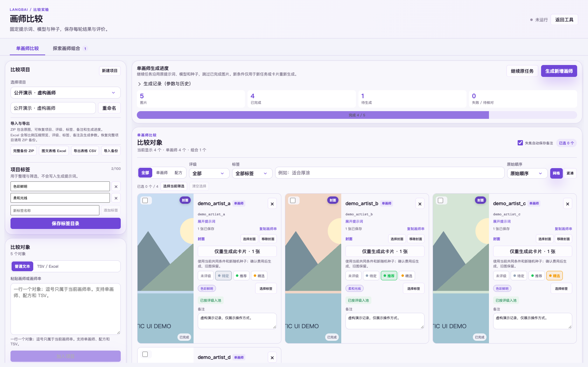
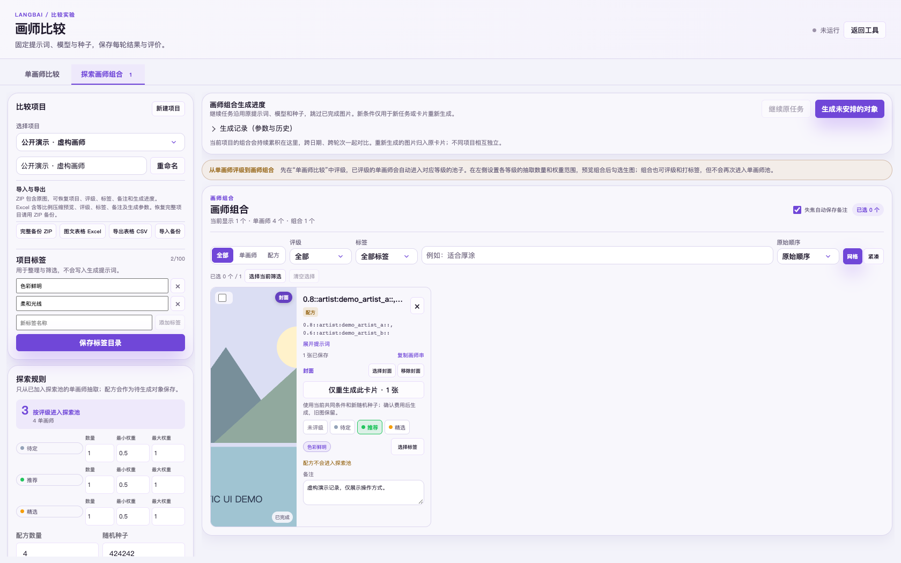

# Artist comparison and pool exploration

Open **Tools → Artist comparison & exploration** in the desktop client. The feature keeps a
long-lived, local library for each project. It lets you compare individual
artists and artist combinations under shared generation conditions, then
organise the results with ratings, labels, notes and covers.

[中文使用指南](./ARTIST_COMPARISON.zh-CN.md)

These two images are synthetic UI demonstrations using fictional names and
drawn landscape placeholders. They are not NovelAI output and do not promise
that a model will recognise any particular artist tag.

## The three concepts

* A **project** is an independent library. A project can contain its own
  entries, ratings, labels, notes, images and generation history. Two projects
  can contain the same artist without sharing data. Keep a long-running
  collection in one project; do not create a new project merely because you
  found a few more artists or changed an exploration rule.
* A **single artist** is one entry whose artist prompt contains no comma. An
  **artist combination** (also called a recipe) is one entry whose prompt
  contains a comma. A generation **run** is a historical batch of jobs with a
  frozen set of entries and generation conditions. Runs are retained inside
  the project so results from different dates can be compared together.

## Add entries and classify them

1. Create or select a project.
2. In **Plain text**, paste one non-empty entry per line and choose **Add to
   project**. The line itself is the prompt sent for that entry.
3. To paste columns copied from Excel, WPS or another spreadsheet, select
   **TSV / Excel** and paste the clipboard text. Map the columns to name,
   prompt and note, then add the mapped rows. This is clipboard TSV support;
   the field does not open an '.xlsx' file directly. An '.xlsx' file is only
   produced by the illustrated export; a full project can be imported from a
   backup ZIP.

Classification follows the prompt field exactly:

* Each physical non-empty line or TSV row is one entry. An embedded newline in
  a prompt is therefore treated as a recipe boundary by the parser.
* A comma or Chinese comma in that prompt makes the entry a combination. The
  comma is not a row separator. Semicolons, parentheses, escaped parentheses
  and other punctuation remain part of a single artist name when there is no
  comma.
* The optional 'artist:' prefix is accepted. The display name column is
  separate from the prompt column in TSV input.

For a safe, fictional example, paste this as plain text:

~~~
demo_artist_a
demo_artist_b
demo_artist_c
demo_artist_a, demo_artist_b
~~~

The first three rows are singles and the last row is one combination. Use a
generic shared positive prompt such as:

~~~
wide cinematic landscape, mountain lake, pine forest, sunrise, soft light, detailed background, no people
~~~

The names above are only documentation fixtures. They are not real artists,
and no model-recognition result is implied.

### Duplicate handling

When entries are added, duplicate **single artists** are skipped both against
the current project and within the pasted batch. Matching trims outer
whitespace, removes a leading 'artist:' prefix, ignores case, treats runs of
spaces and underscores as equivalent, and unescapes escaped parentheses. This
is exact normalisation, not fuzzy matching. Combinations are not merged, and
a similar-looking name in another project is still independent. Existing
entries, images, ratings, labels and notes are never deleted by this check.

Newly accepted entries are prepended to the project library in the order they
were pasted, and are selected automatically. Therefore the normal workflow
for a new batch is:

1. Paste the new artist names and click **Add to project**.
2. Check that the new cards are at the front and selected.
3. Click **Generate new artists**. Only the selected new entries are used.

If every row was a duplicate, the interface reports the skipped rows. After
confirming that nothing was added, there is no need to click **Generate new
artists**. If the selection is later cleared, that action can choose all
still-unscheduled entries of the active kind, so check the selection first.

## Shared conditions and generation runs

Set the shared positive and negative prompts, model, width, height, steps, CFG
and one to ten shared seeds. Every selected entry receives the same seed list.
When a run is created, the entry prompts, shared prompts, model settings and
seeds are snapshotted. Editing the sidebar later does not silently change a
run already in progress or its historical results.

The interface asks for a quote before submitting paid requests. The amount is
an estimated NovelAI Anlas cost for the pending jobs, not an auction or a
price bid. The accepted estimate is a scheduling budget; the service checks
the price again before each image and stops when the approved budget is no
longer sufficient. Actual spending is recorded when the account refresh makes
it available. The account, model permission and official charge remain the
authority.

A single internal run segment contains at most 5,000 jobs (entries multiplied
by seeds), and a run can use at most 10 seeds. A larger selection is split into
multiple persisted segments with the same snapshot. This is a per-operation
queue bound; there is no shared 5,000-entry quota for a project's single
artists and combinations.

## Add artists later and resume safely

The project library is the durable collection; the historical runs are its
generation records. If an older batch is paused at artist 2,000, you can add
three new artists to the same project, generate those three first, and then
click **Resume original task**. The resume control selects the oldest pending
segment, skips jobs already marked done or skipped, and keeps the original
run's prompts, model and seeds. It does not restart the completed part.

Pause the queue before adding a new batch. Pause lets the current image finish
and then stops scheduling the next one. Do not create a new run to resume an
unfinished run. If an entry already has a generation record, **Generate new
artists** will not schedule it again; use the card's single-entry regeneration
action when a fresh image is wanted.

After a restart, a request that was marked running is first matched against the
saved local generation history. If its output is found, it is recovered as
done. If the outcome cannot be determined, the job becomes **Needs review**
(uncertain) and requires an explicit acknowledgement before retrying. A
network failure can happen after the service has accepted a paid request, so
this acknowledgement is a real charge-risk boundary; it is not an exactly-once
network guarantee.

## Ratings, labels, covers and one-card regeneration

Rating levels are editable: you can rename, recolour and reorder them. A
rated single artist automatically belongs to the matching exploration pool;
an unrated single artist does not. A recipe, whether pasted or generated by
exploration, never enters the single-artist pools even if it is rated. Recipes
can still receive ratings, labels and notes for comparison.

The current rating scheme is synchronised to historical runs by stable rating
ID. Removing a used level requires mapping it to another level or explicitly
clearing those ratings. If an old archive contains a removed scheme, the UI
shows an explicit mapping panel; same labels are not guessed to be the same
level.

Each project has a reusable label catalogue. Multiple labels can be assigned
to an entry and used as filters. Labels and notes are organisational metadata;
they are not appended to the generation prompt.

The first successful image of a new run can become the entry's cover. You can
choose another saved image as cover or remove the cover marker without
deleting the original. The card action **Regenerate this card · 1 image** uses
the current shared conditions and a new random seed, asks for the current
quote, and stores a new one-job history while retaining the old images, cover
choice when generation fails, rating, labels and notes.

## Explore artist combinations

Switch to **Explore artist combinations** in the same project. This view
reuses the rated single-artist pools from the comparison view, so combinations
generated today and next month remain together in that project's combination
library. Different projects remain separate.

For each rating level, choose the number of artists and a minimum/maximum
weight. Then choose the number of candidate recipes and a separate recipe
random seed. The preview produces a bounded candidate set (the current UI
accepts 1–100 candidates); it does not enumerate every possible permutation.
Within each recipe, artists are sampled without replacement after the same
normalised identity check used for duplicate handling. If a pool cannot supply
the requested unique artists, the preview reports the shortage instead of
silently repeating one.

Inspect and select the generated recipes before clicking **Generate unscheduled
entries**. They become ordinary recipe cards that can be generated, rated,
labelled and annotated, but they never feed back into the single-artist pools.

## Timing, pause and platform limits

Each project has a minimum and maximum inter-image wait. The default is 30 and
30 seconds. Values range from 0 to 3,600 seconds in 0.1-second increments;
equal bounds make a fixed wait, while 0 and 0 disable the extra wait. After an
image finishes, the queue samples a new value for the next request. A change
applies after the next image completes, and a paused queue retains an already
scheduled deadline. Randomising the wait may be useful for pacing, but it does
not guarantee that NovelAI will permit the request or that platform rate
limits will not apply.

The comparison channel is owned by the desktop main process to survive a
renderer refresh and to prevent overlapping comparison requests. The feature
is currently desktop-only; it does not add a mobile comparison screen.

## Export, backup and storage

The **Import and export** panel offers three different formats:

* **CSV** is a plain, filterable report containing the current library and
  historical run rows, prompts, ratings, labels, notes, seeds, statuses and
  cover information. It does not embed image bytes.
* **Illustrated Excel** ('.xlsx') has separate sheets for single artists,
  combinations, generation conditions and instructions. It embeds one readable
  preview per entry (the selected cover or the latest successful image), plus
  rating, labels, notes, prompts and the saved generation parameters. A preview
  is converted to JPEG quality 78 with a maximum edge of 480 pixels, preserving
  the original aspect ratio, without cropping or enlarging it. It is a report
  for browsing and filtering, not a replacement for the original images or a
  resumable task backup.
* **Full backup ZIP** contains the project manifest, CSV and referenced original
  PNGs with relative paths and SHA-256 checksums. It preserves entries, runs,
  job progress, ratings, labels, notes, covers and interval settings. Import
  validates the archive and creates a separate project; it does not overwrite
  an existing project. The ZIP contains no API token or account settings.

For filesystem-level backup, the desktop feature stores comparison metadata
under the application's user-data directory in 'artist-comparison/'. The
current format has a small 'projects.v1.json' index and a sibling
'projects.v1.json.parts/' directory containing project and run shards. Copy
the entire 'artist-comparison/' directory while the application is closed;
copying only the index is incomplete. Imported images in that directory are
included, but generated comparison images may live in the application's normal
history/output directory. Copy the relevant original image directory too if
you need a complete filesystem restore. The safer portable method is Full
backup ZIP. Failed saves keep the previous committed state.

The current safety bounds are a maximum of 2 GiB for a ZIP archive and its
expanded contents, 32 MiB for its manifest, 64 MiB for an individual image,
and 50 projects. The renderer still has to load project metadata into memory,
so these are safety bounds rather than a promise of unlimited library size.

## Privacy and public contributions

The comparison library, generated images, personal dictionaries, notes and
API credentials are local user data. They are not part of this feature's source
code and must not be committed to a public branch or issue. When reporting a
problem, use fictional names such as 'demo_artist_a', remove local paths and
tokens, and attach only synthetic screenshots or a minimal reproducible
fixture.

## Developer checks

From the desktop project directory:

~~~sh
npm run typecheck
npm test
npm run build
~~~

The feature tests cover multiline and TSV parsing, comma classification,
normalised duplicate handling, rating mappings, deterministic exploration,
exclusion of recipes from pools, durable pause/recovery, approved-cost bounds,
atomic sharded storage and ZIP integrity/path validation. Use isolated
application data for manual testing; never commit a local comparison library
or generated artwork.
