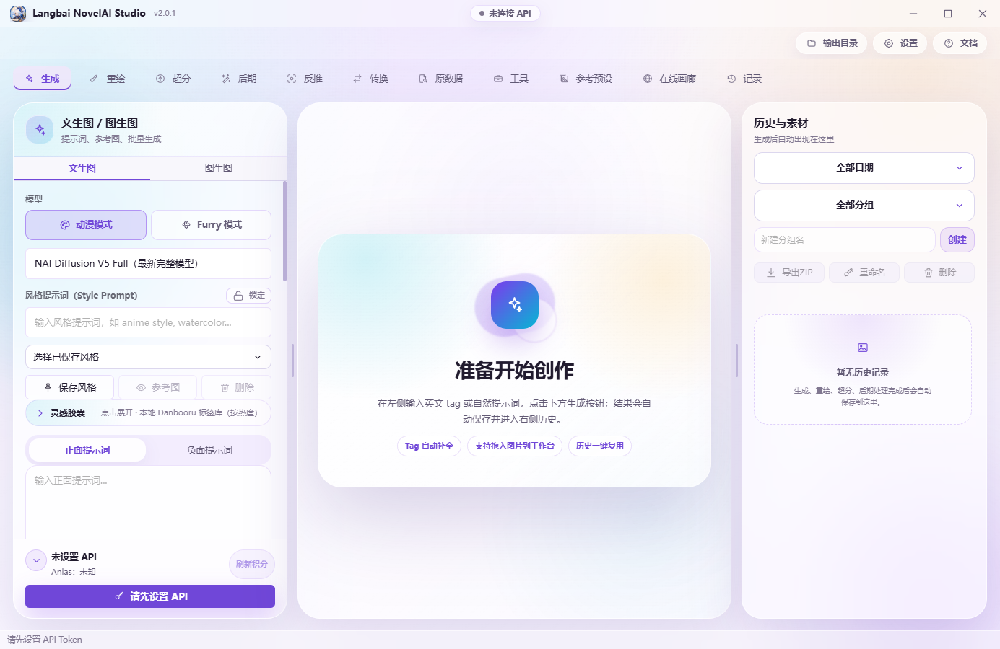

# 首次使用：从下载到第一张图

[返回项目首页](../../README.md) · [功能指南](./FEATURES.md)

本文按 v2.2.4 的功能与配置编写。先完成基础 NovelAI 生图，再逐项启用可选服务。

<a id="install"></a>
## 1. 下载并打开客户端

从[首页下载表](../../README.md#download)选择安装包，或直接进入 [GitHub 最新发行版](https://github.com/2786886095/novelai-image-desktop/releases/latest)。下载的是对应平台安装包，不是发行页底部的 Source code。

| 平台 | 打开方式 |
| --- | --- |
| Windows 安装版 | 运行带 `Setup` 的 `.exe`，按向导选择路径和快捷方式 |
| Windows 便携版 | 直接运行不带 `Setup` 的 `.exe`；首次解压可能需要等待 |

普通使用者无需克隆仓库、执行 `npm install`；这些步骤属于[开发者指南](./DEVELOPMENT.md)。

<a id="token"></a>
## 2. 配置 NovelAI Token

1. 准备自己的 NovelAI 账号，确认对应图像模型的使用权限和可用额度。
2. 打开客户端「设置 → API 配置」，按照软件内的图文教程获取 **Persistent API Token**。
3. 将 Token 粘贴到 NovelAI 配置项，不要粘贴浏览器 Cookie，也不要把其他模型服务的 API Key 当作 NovelAI Token。
4. 点击「验证 Token / 刷新积分」，确认账号连接状态与余额。

Token 属于账号凭据，请只放在本机配置中，不要贴到 Issue、截图或聊天群。

### 网络怎么选

默认使用「自动跟随系统代理 / VPN」。系统代理或 PAC 按请求地址选择线路，TUN / 虚拟网卡模式由系统路由接管。只有选择手动代理模式时才需要填写 HTTP / SOCKS5 地址。

GitHub / Gitee **下载源**控制安装包与更新下载，不会把 NovelAI 生图接口切换成国内镜像。

<a id="first-image"></a>
## 3. 生成并找到图片

1. 进入「生成 → 文生图」，选择账号可用模型。不同模型支持的参数可能不同，以软件当前显示为准。
2. 输入下面这段简单提示词，暂时保留默认参数，张数设为 1。
3. 确认尺寸与预计费用，再点击生成。不要在等待期间反复提交。
4. 桌面端使用顶部「输出目录」查看文件，或在右侧历史与素材中查看结果。

```text
1girl, solo, blue hair, blue eyes, white dress, garden, sunlight, smile
```



*上图来自 2026-08-30 的 v2.0.1 界面取证；新版导航与部分控件有所变化。*

第一次成功后，可复用历史参数并固定 Seed，只修改一个标签来观察变化；也可将已有图片送入图生图或重绘。

<a id="optional"></a>
## 4. 按需配置扩展能力

| 想使用的能力 | 额外配置 | 检查方法 |
| --- | --- | --- |
| 图片反推 | 「设置 → AI 反推」中的视觉模型 API 地址、Key 与模型 | 检测接口并选择支持图片输入的模型，先用一张简单图片测试 |
| 提示词转换 | 「设置 → 转换 API」中的文本模型配置 | 检测接口后转换一段短描述 |
| 酒馆对话生图 | 酒馆使用的对话模型配置；生成仍需 NovelAI Token | 先发送普通对话，再用「确认后生图」检查方案与费用 |
| 中文翻译 | 设置中选择谷歌翻译或配置百度翻译 APP ID / 密钥 | 尝试翻译一段短提示词，确认网络或服务凭据可用 |
| 扩展标签检索 | 提示词 / 补全中的 Tag / MCP 服务 | 按所用服务配置地址和传输方式；本地词库可先单独使用 |

反推与转换可以独立配置；自定义 JSON 预设也可导入、重命名和删除。模型服务的 Key 不会替代 NovelAI 生图 Token。

酒馆建议先保留「确认后生图」：检查 AI 整理的提示词、右侧风格与参数，再确认调用。熟悉后再切换「全自动生图」。

<a id="updates"></a>
## 5. 保存、备份与更新

- **Windows 共享数据**：安装版与便携版均使用 `%APPDATA%\novelai-image-desktop\`。便携版不是零痕迹模式；图片还可能位于自定义输出目录。
- **先备份再迁移**：重要作品单独备份。跨电脑迁移前同时检查配置目录、输出目录与预设导出文件，不要只复制程序。
- **Windows 安装版**：支持软件内下载更新并重启安装；失败时尝试备用源。
- **Windows 便携版**：按更新提示进入发行页，手动下载新包替换。
- **下载源**：设置可选 GitHub / Gitee，默认 GitHub。某个镜像资产尚未同步时，可直接切回 GitHub。

<a id="troubleshooting"></a>
## 连接或生成失败时

| 现象 | 优先检查 |
| --- | --- |
| Token 验证失败或 HTTP 401 | 凭据属于哪一个服务、是否粘贴完整、是否过期；重新验证对应配置 |
| 余额不足或模型不可用 | NovelAI 账号权限、额度与本次尺寸 / 张数；实际状态以官方为准 |
| 对话能回复，但生图失败 | 对话模型与 NovelAI 是两条连接，分别检查 Token、余额与生图错误 |
| 反推失败，但转换成功 | 视觉 API 是否支持图片输入、模型名称与接口地址是否匹配 |
| 连接超时、连接重置 | 系统代理 / VPN、手动代理地址、对应服务可达性；更换下载源不会修复生图网络 |
| 超时后不确定是否已扣费 | 先检查余额、历史和输出目录，再决定重试，避免重复生成 |
| 图生图尺寸变化 | 软件会适配有效的 64 倍数尺寸；提交前查看最终宽高 |
| 原数据读取不到提示词 | 图片可能没有嵌入元数据，或经平台压缩后被移除；优先使用原始图片文件 |

反馈时提供软件版本、系统、功能入口、复现步骤和脱敏错误信息：[提交 Issue](https://github.com/2786886095/novelai-image-desktop/issues/new)。
